## 🟡 Idea Description:
The main objective of the Online Blogging System is to showcase the details of Blogs, Idea, Content of a person. The purpose of the project is to build a website that gives people a platform to share what they feel. User can simply create a post through a post create button Which will take entry of the content with title and content will be published in the form of blog. The website will contain specific section for- creation of post, a login and sign-up section, a contact or query section that gives us feedback or review in a tabulated form through which we can Change or update anything on user request.
The home section will be where all blogs will be displayed, the composed blog or post can also be deleted with delete button or edited with edit button option available at the bottom of composed blog by the user from my blogs section when the person is logged in.
  

##### Admin panel:
###### (Hidden feature that only admins can access)  
With /admin website offers admin activity exclusively for admins of the website 
where we can get the querries,feedback of the poeple that people enter in contact us section
also under circumstance admins have full authority to delete any post avaible on the website.
primaryly 2 Admins are defined,to access admin panel you can only use our defined admins  
1.Shuja 
adminPassword = GK2225Shuja 
username = bloggerShuja  
2.Faheem 
adminPassword = GJ8950Faheem 
username = bloggerFaheem  
(Username and password both are Case sensitive.)  
For more look in snapshots. 

### How to run Locally?
⚡Steps:
- Clone the repository.
- Find Blog_website.sql file and import the sql to phpmyadmin
- copy and paste folder in htdocs i.e Xampp 
- open your browser
- Copy and past: http://localhost/blogger/index.php
- Now you are good to go 
- Currently it isn't reposnsive on small media devices.
- Contribute to make it responsive and beautiful for different media.

### Languages and Tools:

 
-Frontend

   

-Behavior
  

-Backend and Data 
  
   

-Authentication

   

## Snaptshots
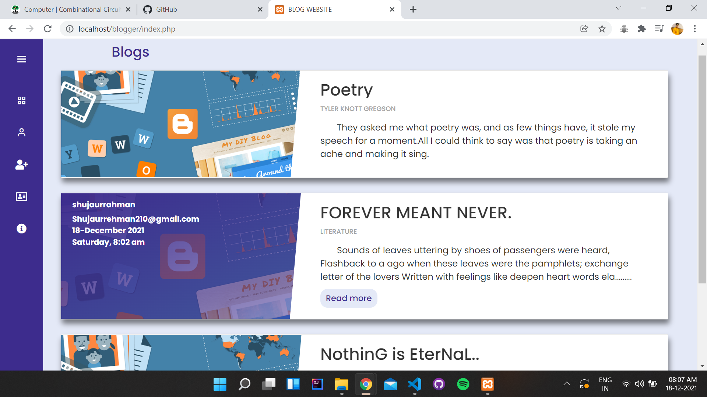
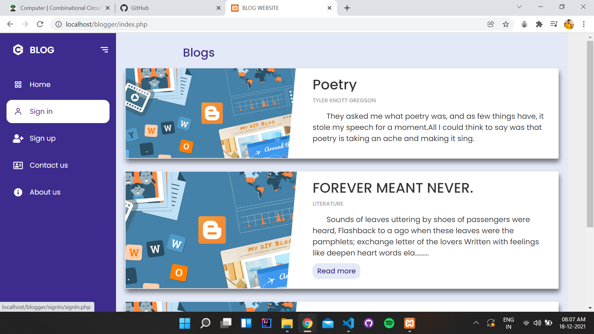
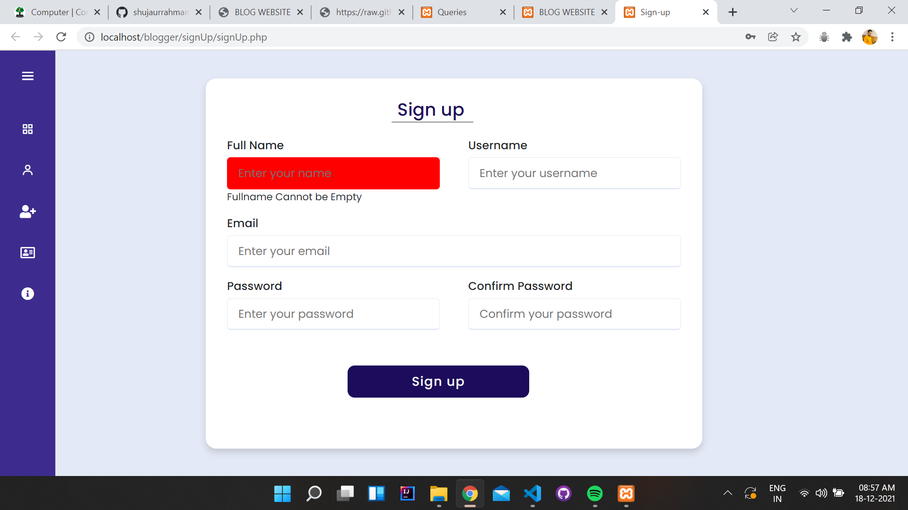
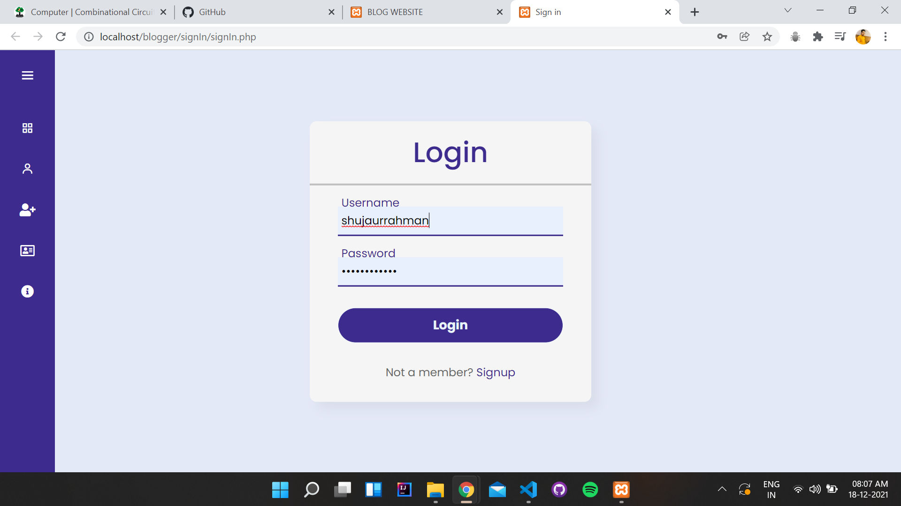
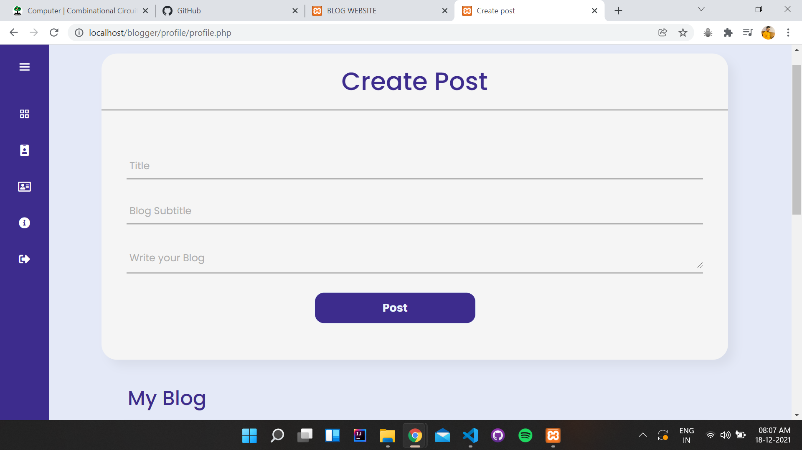
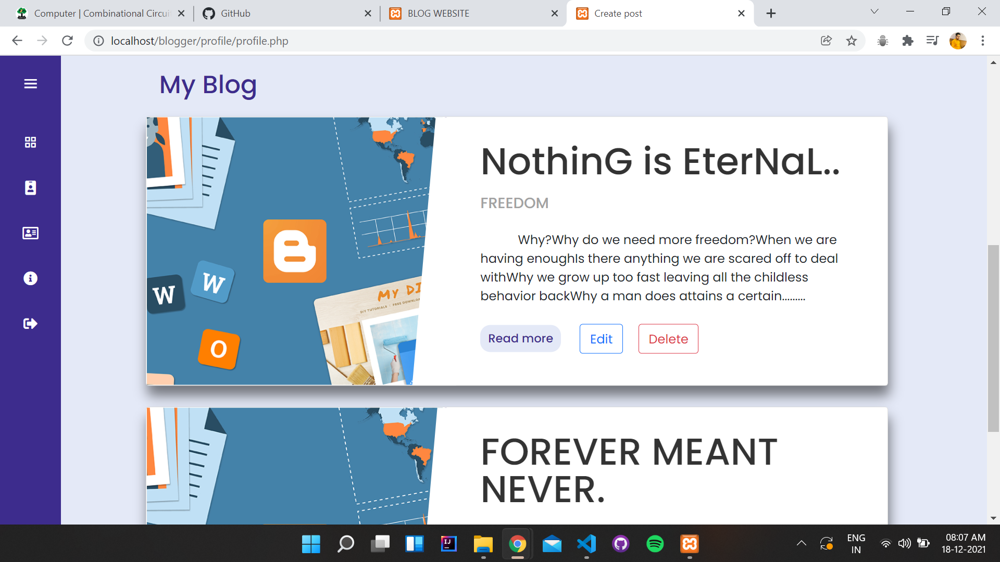
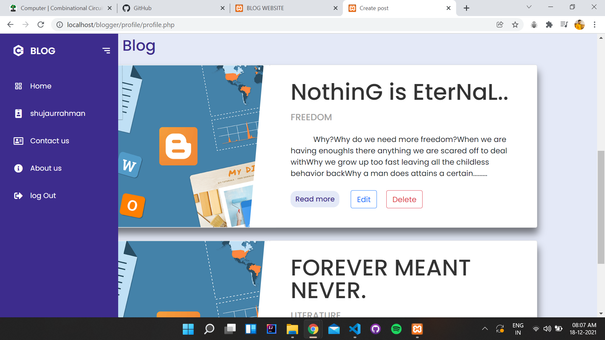

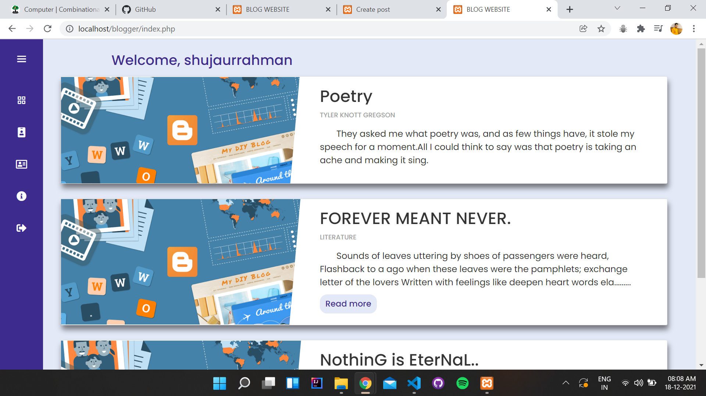
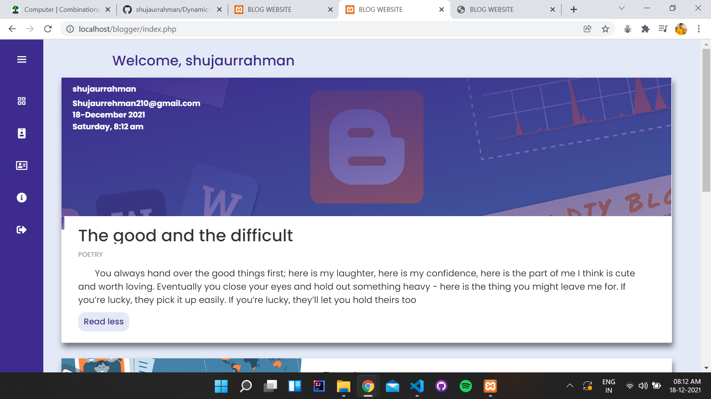
 
### Admin Panel
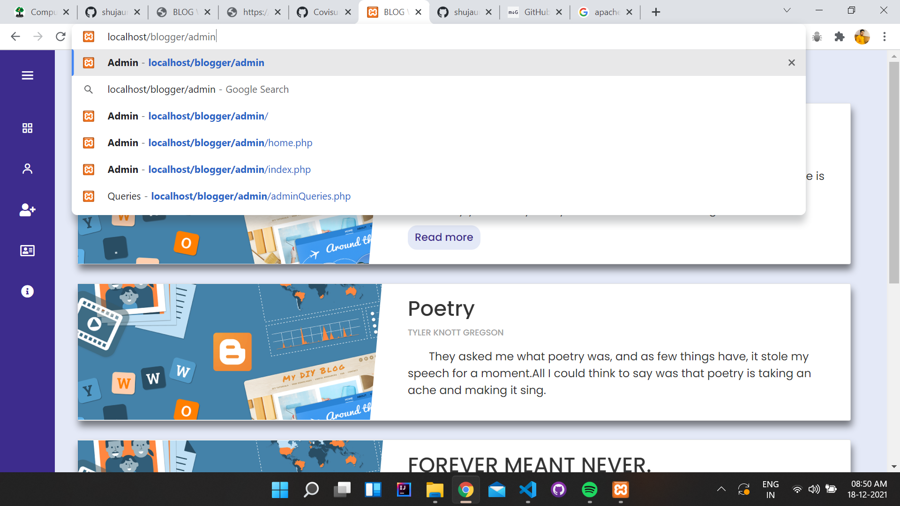
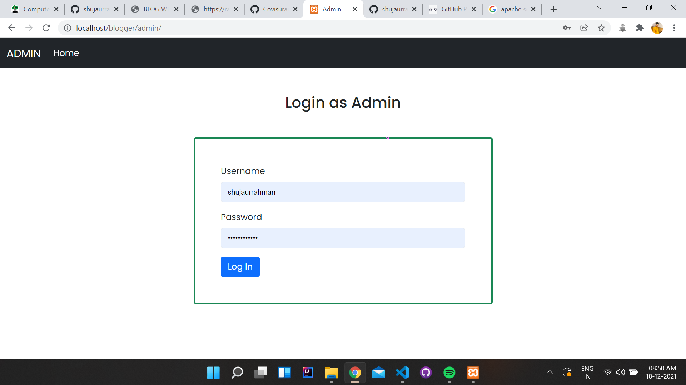
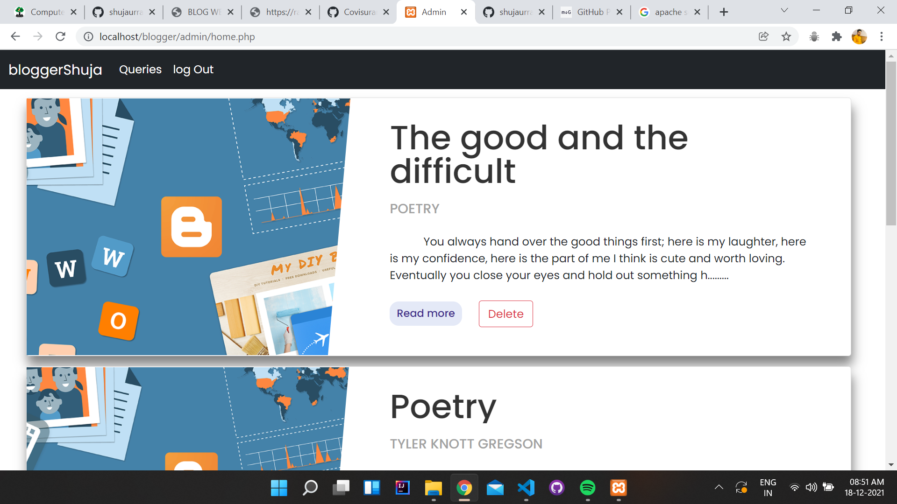
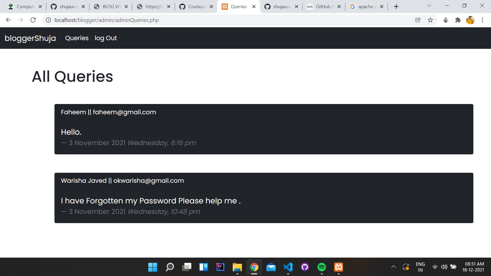
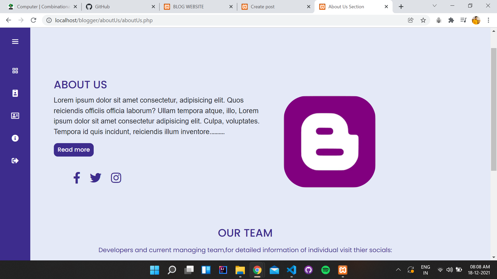

### Hosted Here:
#### [Blogger Website](http://blogamu.epizy.com/?i=1) : View on desktop (Not Responsive in small media)
- keep in mind this is free server where the site is hosted,have patience if it loads slowly. :)
- website in no way near to fully responsive for small media devices

### Let's Connect :coffee:

	
	
	
	
  

Website Developed by 
- Shuja ur Rahman  
 📫Reach me: **shujaurrehman210@gmail.com** 
 👨‍💻check out my portfolio at:[shuja-on-web](https://shujaurrahman.github.io/shuja-on-web/) 
 
 - Mohd Faheem Ahmad 
  📫Reach me:**mohdfaheemahmad5@gmail.com** 
   👨‍[Faheem Gitub Profile] (https://github.com/fffaheem)

